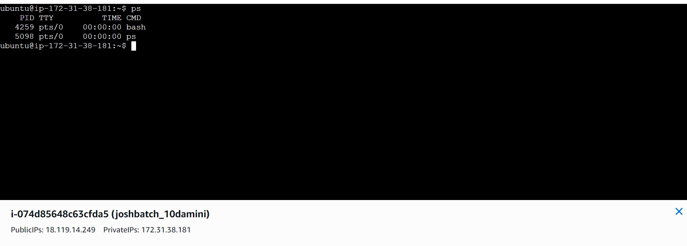
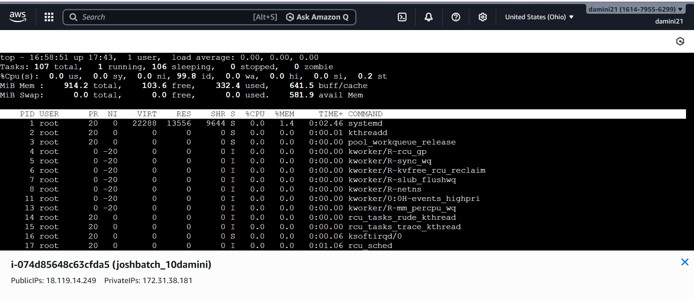
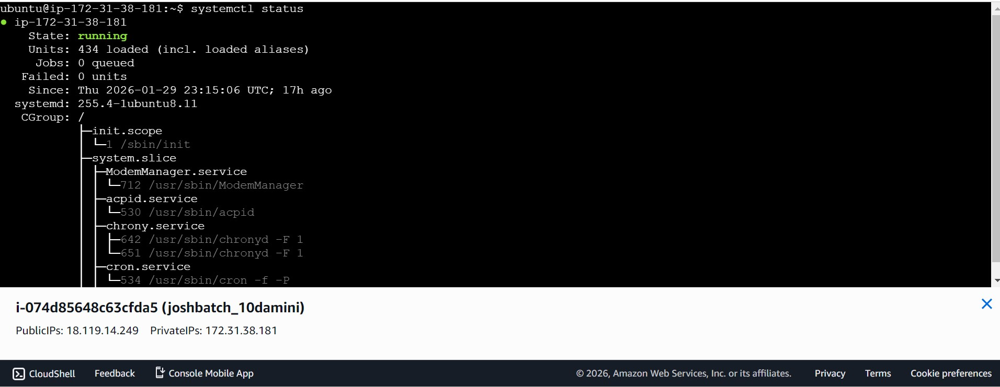
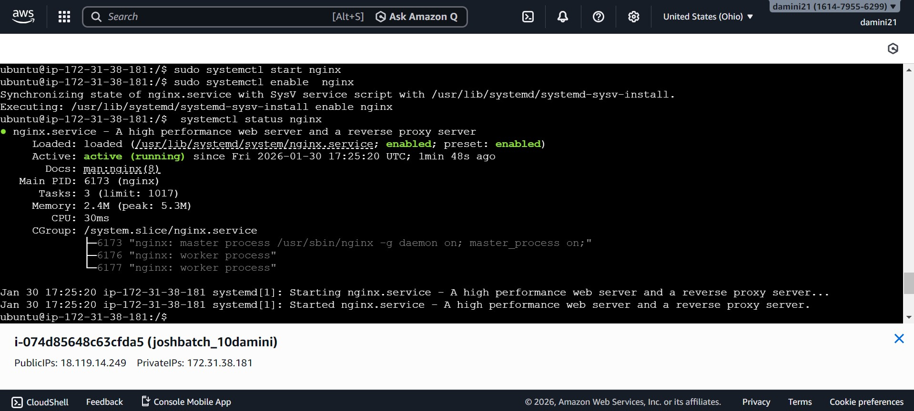
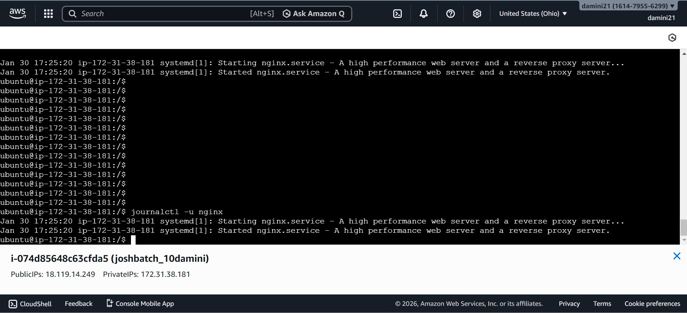

**practice Linux fundamentals with real commands**

Run and record output for **at least 6 commands**

**process commands** (`ps`, `top`, `ps aux`, etc.)

1.  ps = Shows a snapshot of running processes (not real-time).

   
   

2. Top  = show real time performance 

3. ps aux - display a comprehensive list of all currently running processes on the system .

**2 service commands** (`systemctl status`, `systemctl list-units`, etc.)

1. system ctl status = a core Linux command for checking the runtime status, recent logs, and state (active, inactive, failed) of systemd services

2. systemctl lists-units   = display currently loaded and active units on the system

**2 log commands** (`journalctl -u <service>`, `tail -n 50`, etc.)

1. journalctl -u nginx =  display all log messages generated by the Nginx web server service 
  . i installed the nginx first 
  . sudo apt update 
  . sudo apt install nginx -y
  . sudo systemctl start nginx 
  . sudo systemctl enable nginx
  . systemctl status nginx

