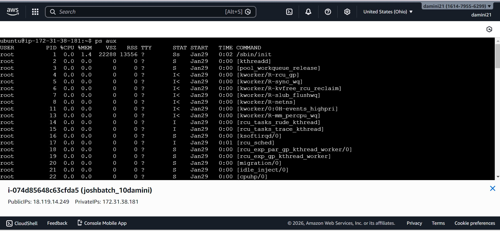
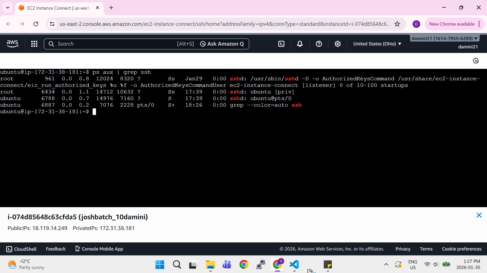
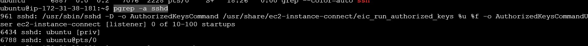
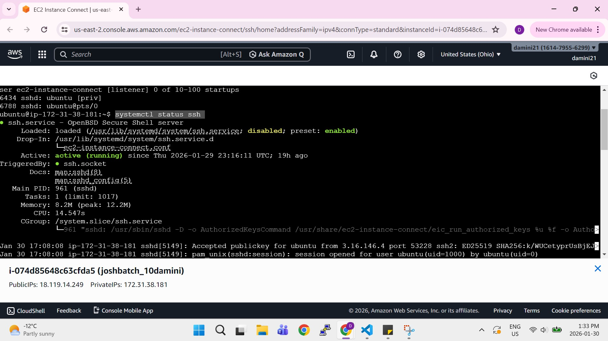
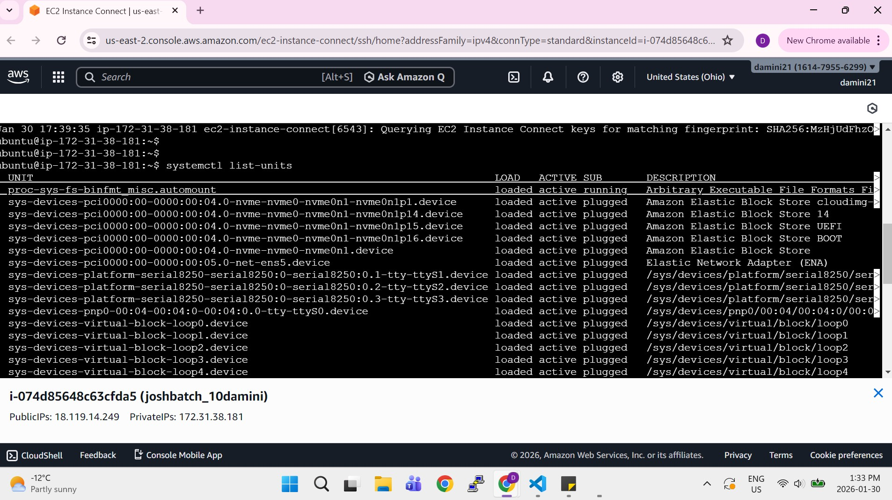
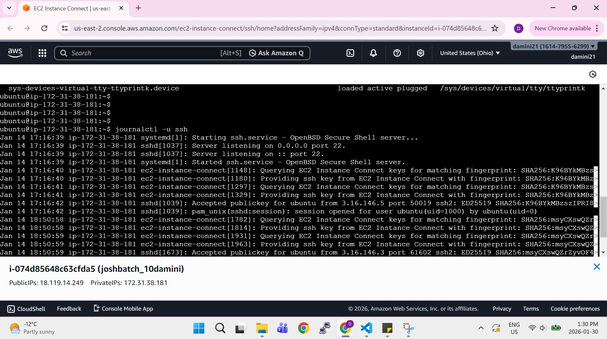
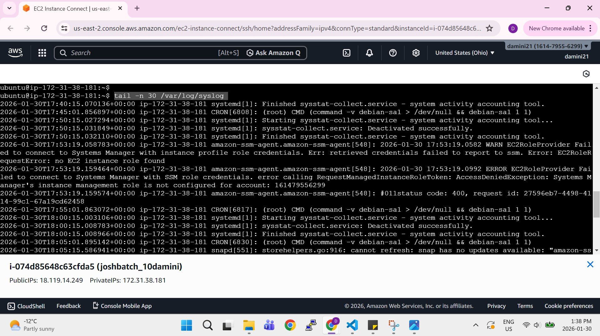

**practice Linux fundamentals with real commands**

Run and record output for **at least 6 commands**

**process commands** (`ps`, `top`, `ps aux`, etc.)

1.  ps = Shows a snapshot of running processes (not real-time).

   
   

2. Top  = show real time performance 

3. ps aux - display a comprehensive list of all currently running processes on the system .

**service commands** (`systemctl status`, `systemctl list-units`, etc.)

1. systemctl status = a core Linux command for checking the runtime status, recent logs, and state (active, inactive, failed) of systemd services

2. systemctl lists-units   = display currently loaded and active units on the system

** log commands** (`journalctl -u <service>`, `tail -n 50`, etc.)

  journalctl -u nginx =  display all log messages generated by the Nginx web server service 
  1.  i installed the nginx first 
  2. sudo apt update 
  3. sudo apt install nginx -y
  4. sudo systemctl start nginx 
  5. sudo systemctl enable nginx
  6. systemctl status nginx

  output :

  

  

  . tail -n 30 = prints the last few number of lines (10 lines by default) of a certain file, then terminates.
 - i used this command to specify the file tail -n 50 /var/log/syslog

one service on your system** (example: `ssh`, `cron`, `docker`) and inspect it

 Service inspected: ssh

1. ps aux | grep ssh

2. pgrep -a sshd

3. systemctl status ssh

4. systemctl list-units 

5. journalctl -u ssh 

6. tail -n 30 /var/log/syslog

