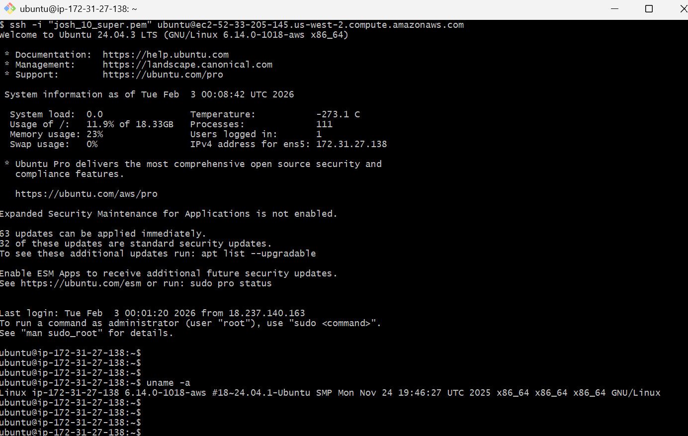
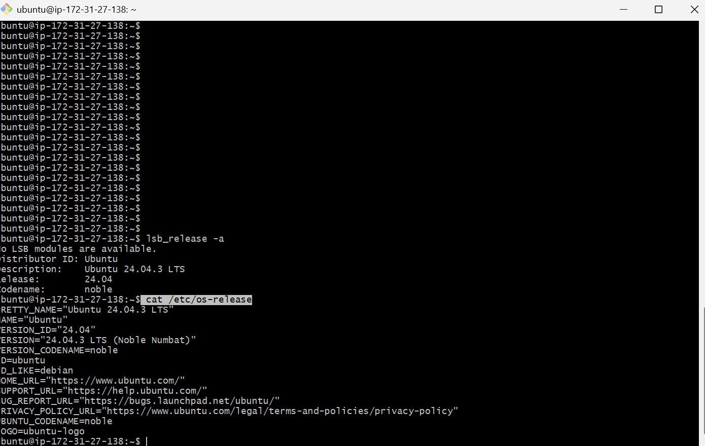
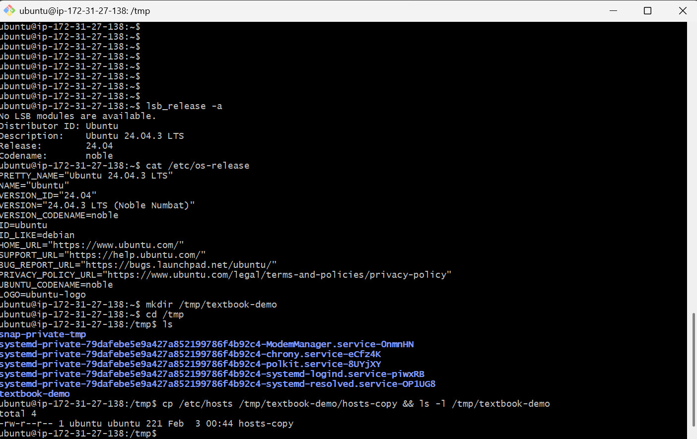
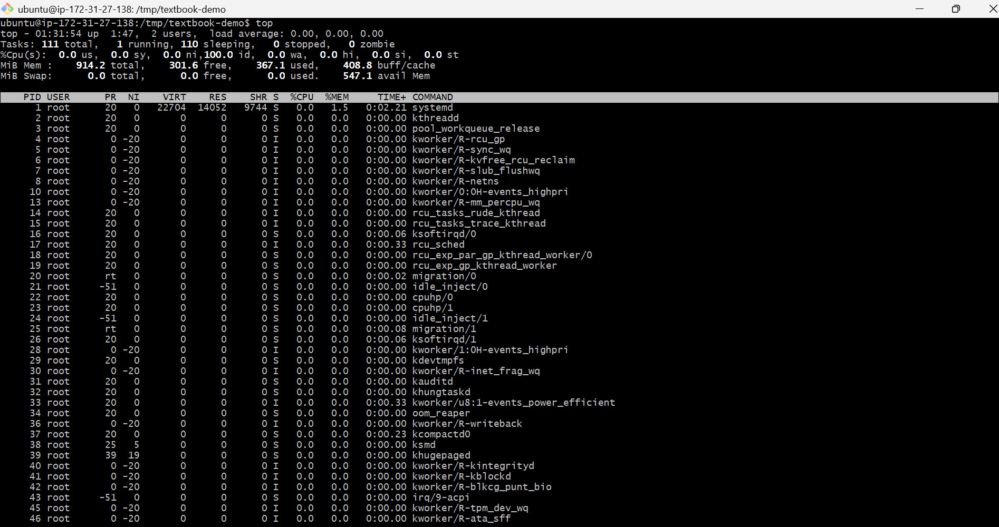
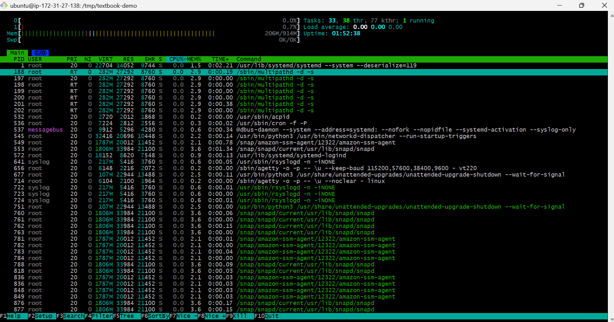
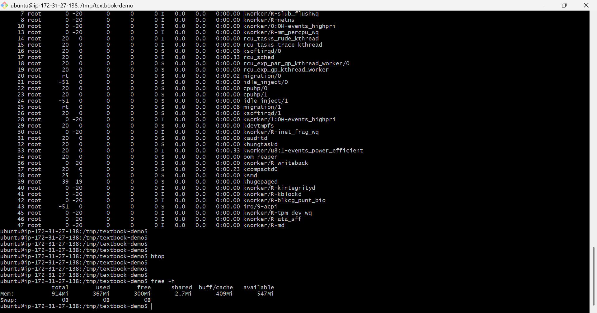
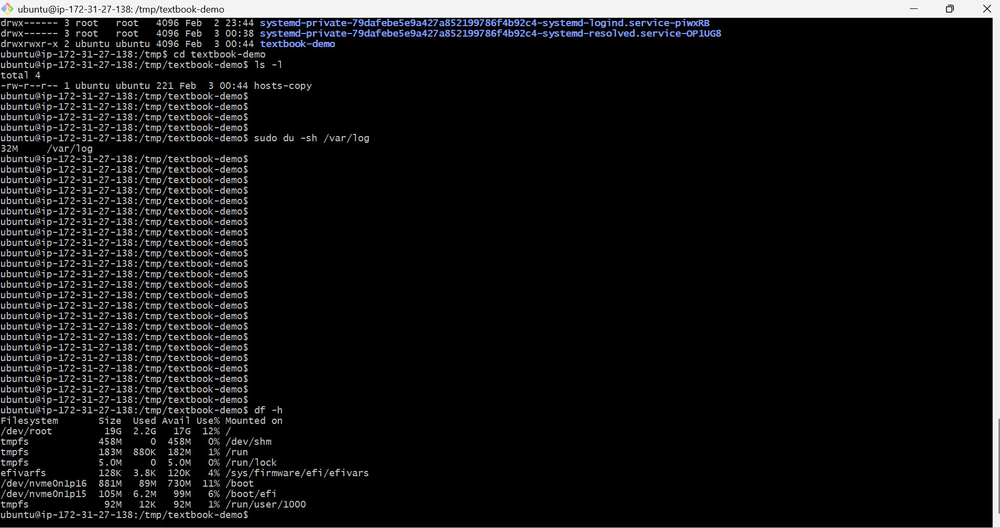
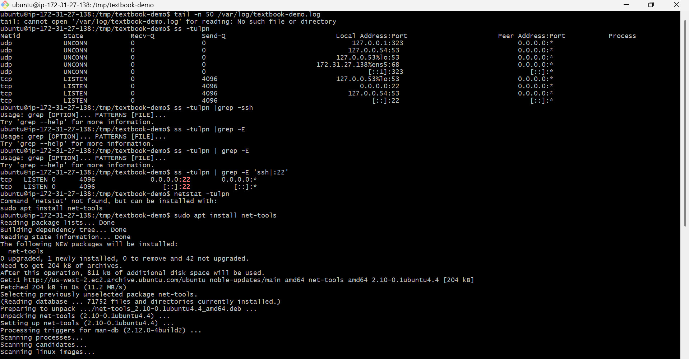
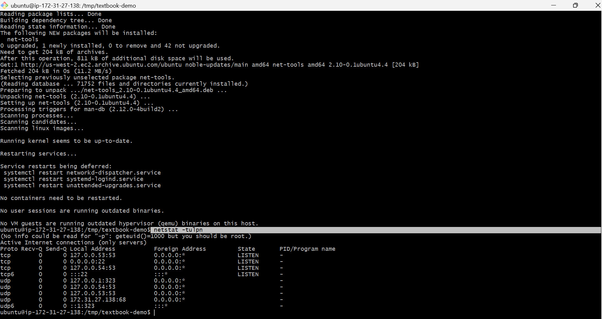

## day -05 ##

* Target service / process will be ssh performed on  aws Ec2 ubuntu instance .

**Environment basics**
Command : `uname -a`, `lsb_release -a` (or `cat /etc/os-release`)
observation : kernal version , architecture and ubuntu details .

**Filesystem sanity** 
Command :  mkdir /tmp/textbook-demo
cp /etc/hosts /tmp/textbook-demo/hosts-copy && ls -l /tmp/textbook-demo

Observation: copied file can be seen in listed directory 

**CPU / Memory** 
 top 
 htop 
 free -h

Observation: System memory usage is moderate and no swap configured

Snapshot: CPU & Memory

**Disk / IO** 
df -h
du -sh /var/log

Observation: Root filesystem is only 12% utilized (17GB available), indicating ample disk capacity and no immediate risk of disk exhaustion. All tmpfs and boot partitions also show minimal usage.

/var/log is only 32MB, indicating logs are under control and not contributing to disk space issues.

 Snapshot: Disk & IO
 

**Network (2):** `ss -tulpn`/`netstat -tulpn`, `curl -I <service-endpoint>`/`ping`

* Snapshot: Network

**Logs (2):**  journalctl -u ssh -n 50
observation - no signs of service failure , no crashes or persistent SSH errors detected.

* snapshot Logs 

*  Quick findings
- SSH is working fine 
- CPU and memory is moderate 
- disk space is under control 
- no SSH errors detected
