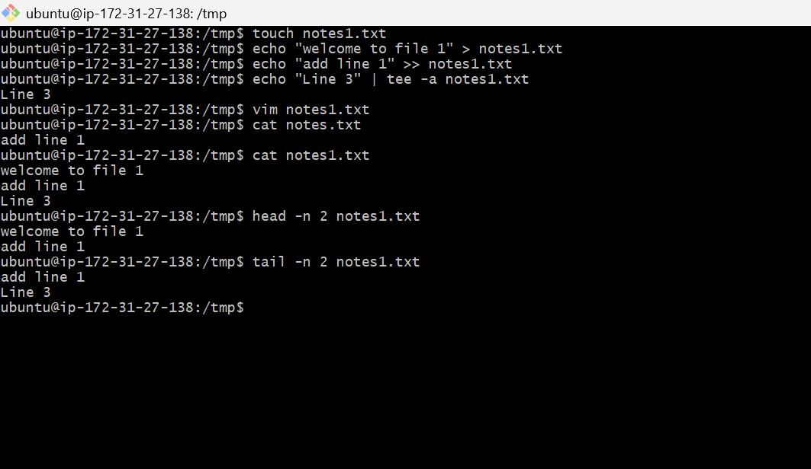

# Day 06 – Linux Fundamentals: Read and Write Text Files

- Create a file named `notes.txt`
 touch notes.txt

- Write 3 lines into the file using **redirection** (`>` and `>>`)

write :
. echo "Line 1" > notes.txt

Append 
. echo "Line 2" >> notes.txt

Append and display using tee
. echo "Line 3" | tee -a notes.txt

- Use **`cat`** to read the full file
Read the full file
cat notes.txt

Use **`head`** and **`tail`** to read parts of the file
Read the first two lines
head -n 2 notes.txt

Read the last two lines
tail -n 2 notes.txt

screenshot :

 

