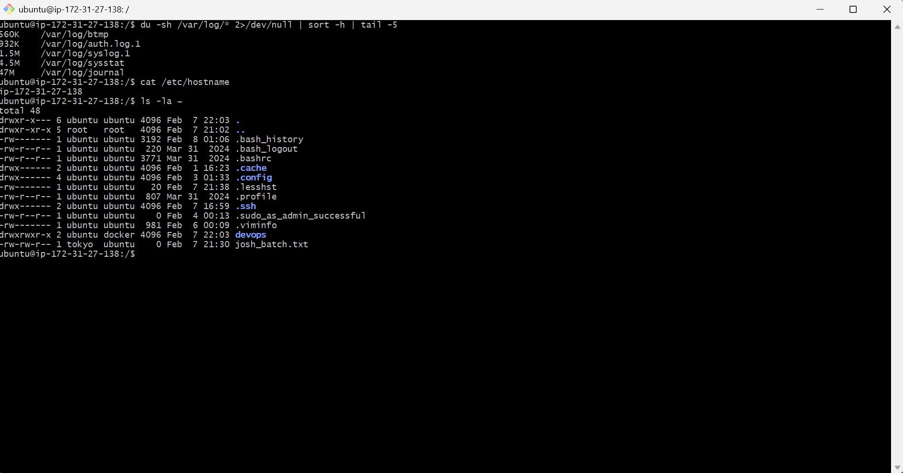

### Part 1: Linux File System Hierarchy 

Document the purpose of these **essential** directories:

**Core Directories (Must Know):**
- `/` (root) 
- The top-level directory of Linux. Every file and directory starts from here.
- Example folders seen: `bin`, `etc`, `home`, `var`
- I would use this when understanding overall system structure.


- `/home` - User home directories
- Contains home directories for normal users.
- Example folder: `/home/ubuntu`
- I would use this when managing user files and scripts.


- `/root` - Root user's home directory
- Home directory for the root user.
- Used mainly for administrative tasks.
- I would use this when logged in as root for system-level operations.


- `/etc` - Configuration files
- Contains system-wide configuration files.
- Example file: `/etc/hostname`
- I would use this when changing service or system configuration.


- `/var/log` - Log files (very important for DevOps!)
- Stores system and application log files.
- Example logs: `syslog`, `auth.log`
- I would use this when troubleshooting services and errors.


- `/tmp` - Temporary files
- Stores temporary files.
- Files here can be deleted automatically.
- I would use this for temporary scripts or downloads.


**Additional Directories (Good to Know):**
- `/bin` - Essential command binaries
- Essential system binaries like `ls`, `cp`, `mv`
- Needed for basic command execution.
- I would use this during system recovery or minimal environments.


- `/usr/bin` - User command binaries
- User-level binaries.
- Example commands: `vim`, `top`, `journalctl`
- I would use this for daily Linux operations.


- `/opt` - Optional/third-party applications
- Optional or third-party applications.
- Used by custom software installations.
- I would use this when installing external applications.


**Hands-on task:**

du -sh /var/log/* 2>/dev/null | sort -h | tail -5
cat /etc/hostname
ls -la ~


screenshot :



**Scenario 1: Service Not Starting** 

A web application service called 'myapp' failed to start after a server reboot.
What commands would you run to diagnose the issue?
Write at least 4 commands in order.

Check service status
systemctl status nginx  

Why:
To see whether the service is active, failed, or inactive, and to get initial error messages and the main PID.

Logs for thr service 
journalctl -u nginx   -n 50

Why:Logs usually explain why the service failed (configuration error, port conflict, missing file, permission issue).

service is enabled at boot 
systemctl is-enabled nginx  

Why:If the service is disabled, it won’t start automatically after a reboot.


system-wide errors noticed during boot
journalctl -xe

Why:Shows critical system errors that may affect the service (dependency failures, permission issues, missing mounts).


one extra step to retart the service 
sudo systemctl restart nginx
Why:
To confirm whether the issue is persistent or was caused by a temporary boot-time failure.


**Scenario 2: High CPU Usage** 
Your manager reports that the application server is slow.
You SSH into the server. What commands would you run to identify
which process is using high CPU?

- command that shows **live** CPU usage

top 
Why: top shows real-time CPU usage and quickly tells you if the system is under CPU pressure.


- Sort processes by CPU usage
ps aux --sort=-%cpu | head -10 

Why: This gives a static, sorted list of top CPU-consuming processes


**Scenario 3: Finding Service Logs** 

A developer asks: "Where are the logs for the 'docker' service?"
The service is managed by systemd.
What commands would you use?


# Check service status first
systemctl status docker

# View last 50 lines of logs
journalctl -u docker -n 50

# Follow logs in real-time
journalctl -u docker -f


**Scenario 4: File Permissions Issue** 
```
A script at /home/user/backup.sh is not executing.
When you run it: ./backup.sh
You get: "Permission denied"

What commands would you use to fix this?

**Step-by-step solution structure:**
```
Step 1: Check current permissions
Command: ls -l /home/user/backup.sh
Look for: -rw-r--r-- (notice no 'x' = not executable)

Step 2: Add execute permission
Command: chmod +x /home/user/backup.sh

Step 3: Verify it worked
Command: ls -l /home/user/backup.sh
Look for: -rwxr-xr-x (notice 'x' = executable)

Step 4: Try running it
Command: ./backup.sh


screenshot :


