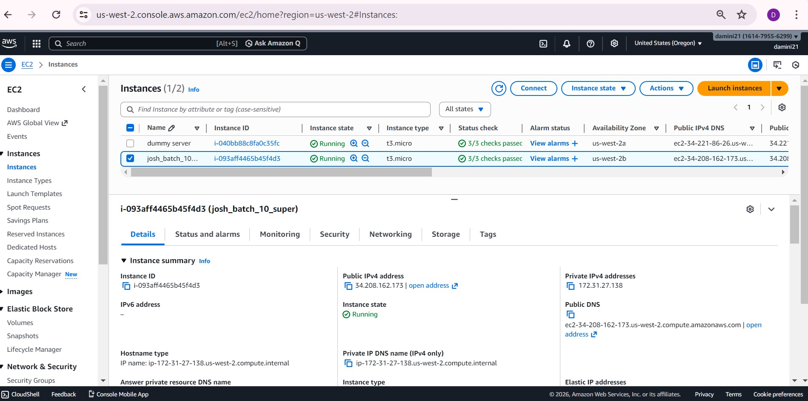
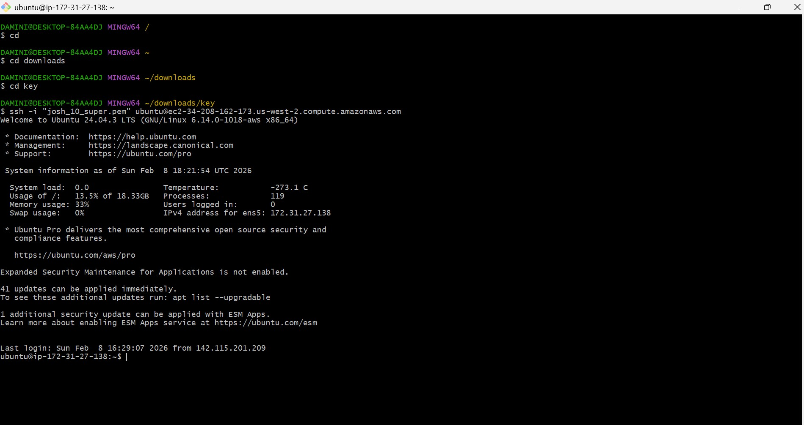
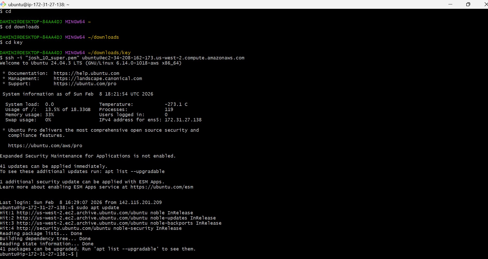
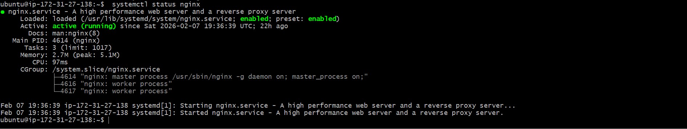

## Part 1: Launch Cloud Instance & SSH Access (15 minutes)

**Step 1: Create a Cloud Instance**

screenshot :

**Step 2: Connect via SSH**

screenshot :

### Part 2: Install Docker & Nginx (20 minutes)

**Step 1: Update System**
sudo apt update 

screenshot :

**Step 3: Install Nginx**

sudo apt install nginx

**Verify Nginx is running:**

systemslt status nginx

screenshot :

### Part 3: Security Group Configuration (10 minutes)

**Test Web Access:**
Open browser and visit: `http://<your-instance-ip>`

You should see the **Nginx welcome page**!

📸 **Screenshot this page** - you'll need it for submission

