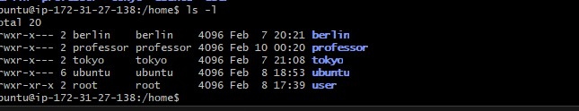
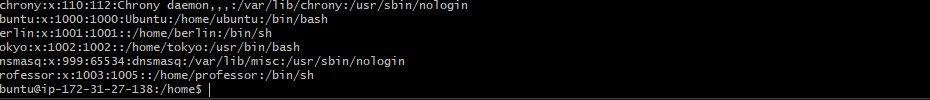
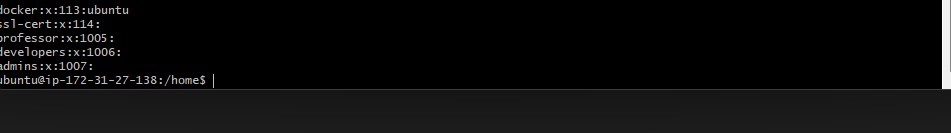
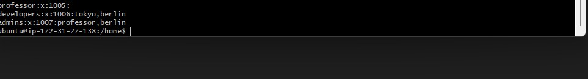
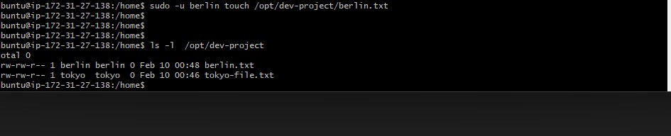
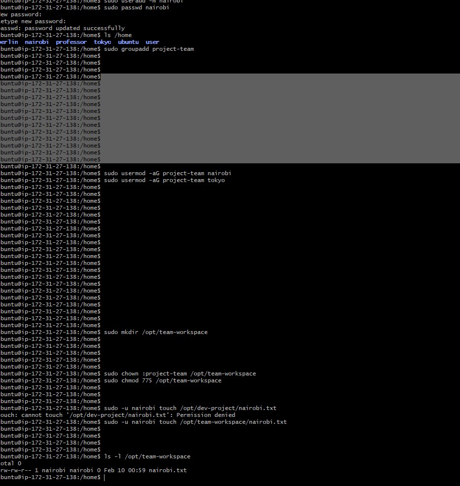

### Task 1: Create Users (20 minutes)

Create three users with home directories and passwords:
- `tokyo`
- `berlin`
- `professor`

sudo useradd -m tokyo
sudo useradd -m berlin
sudo useradd -m professor

Screenshot :

sudo passwd tokyo
sudo passwd berlin
sudo passwd professor

**Verify:** Check `/etc/passwd` and `/home/` directory
Screenshot :

### Task 2: Create Groups (10 minutes)

Create two groups:
- `developers`
- `admins`

**Verify:** Check `/etc/group`
Screenshot :

### Task 3: Assign to Groups (15 minutes)

Assign users:
- `tokyo` → `developers`
- `berlin` → `developers` + `admins` (both groups)
- `professor` → `admins`

**Verify:** Use appropriate command to check group membership

Screenshot :

### Task 4: Shared Directory (20 minutes)

1. Create directory: `/opt/dev-project`
sudo mkdir /opt/dev-project 

2. Set group owner to `developers`
sudo chown :developers /opt/dev-project

3. Set permissions to `775` (rwxrwxr-x)
   sudo chmod 775 /opt/dev-project

4. Test by creating files as `tokyo` and `berlin`
Two ways :sudo su - tokyo
cd /opt/dev-project
touch tokyo-file.txt
ls -l

second : sudo -u berlin touch /opt/dev-project/berlin.txt

**Verify:** Check permissions and test file creation

screenshot :

### Task 5: Team Workspace (20 minutes)

1. Create user `nairobi` with home directory
2. Create group `project-team`
3. Add `nairobi` and `tokyo` to `project-team`
4. Create `/opt/team-workspace` directory
5. Set group to `project-team`, permissions to `775`
6. Test by creating file as `nairobi`

screenshot :

