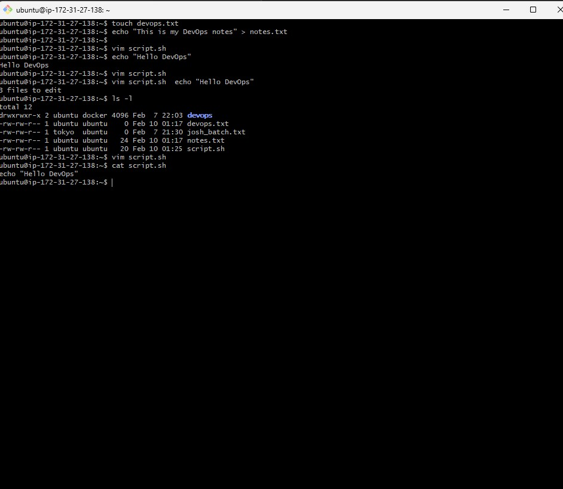
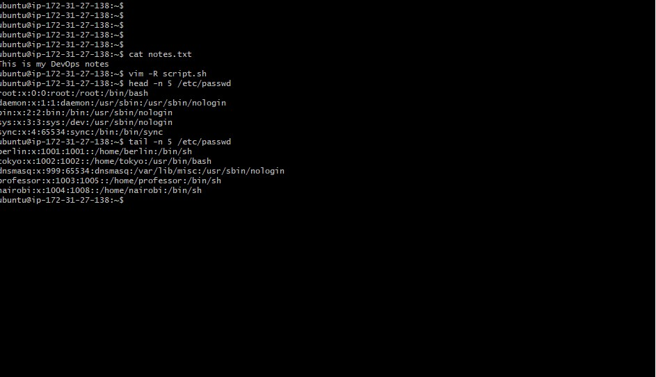
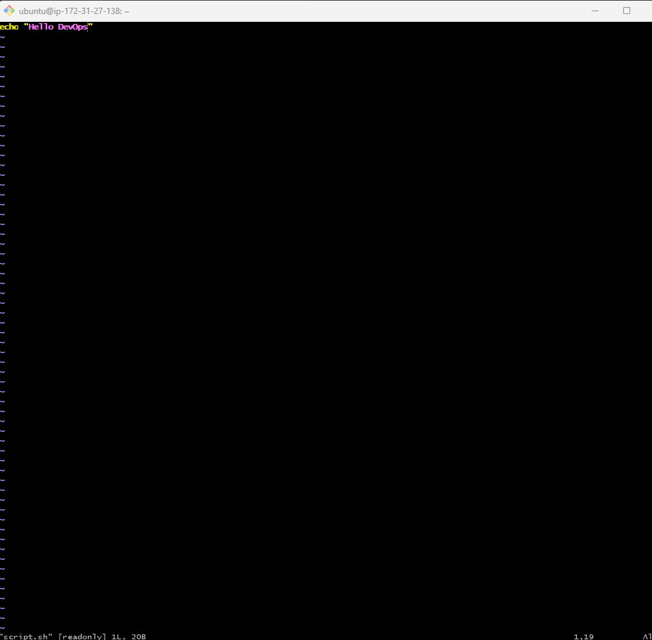
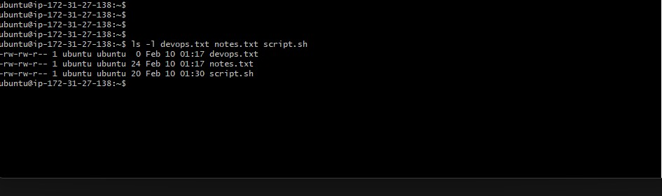
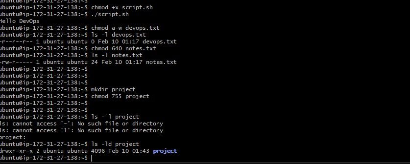

### Task 1: Create Files (10 minutes)

1. Create empty file `devops.txt` using `touch`
touch devops.txt

2. Create `notes.txt` with some content using `cat` or `echo`

echo "This is my DevOps notes" > notes.txt
3. Create `script.sh` using `vim` with content: `echo "Hello DevOps"`

vim script.sh  echo "Hello DevOps"

**Verify:** `ls -l` to see permissions
screenshot :

---

### Task 2: Read Files (10 minutes)

1. Read `notes.txt` using `cat`
cat notes.txt

2. View `script.sh` in vim read-only mode  
vim -R script.sh

3. Display first 5 lines of `/etc/passwd` using `head`
head -n 5 /etc/passwd
4. Display last 5 lines of `/etc/passwd` using `tail`
tail -n 5 /etc/passwd

screenshot :

---

### Task 3: Understand Permissions (10 minutes)

Format: `rwxrwxrwx` (owner-group-others)
- `r` = read (4), `w` = write (2), `x` = execute (1)

Check your files: `ls -l devops.txt notes.txt script.sh`

Answer: What are current permissions? Who can read/write/execute?

screenshot :

---

### Task 4: Modify Permissions (20 minutes)

1. Make `script.sh` executable → run it with `./script.sh`
chmod +x script.sh

Run -./script.sh

2. Set `devops.txt` to read-only (remove write for all)
chmod a-w devops.txt

3. Set `notes.txt` to `640` (owner: rw, group: r, others: none)
chmod 640 notes.txt

4. Create directory `project/` with permissions `755`
mkdir project 
-- chmod 755 project

**Verify:** `ls -l` after each change

ls -ld project 

screenshot :

---

### Task 5: Test Permissions (10 minutes)

1. Try writing to a read-only file - what happens?
2. Try executing a file without execute permission
3. Document the error messages

screenshot :

