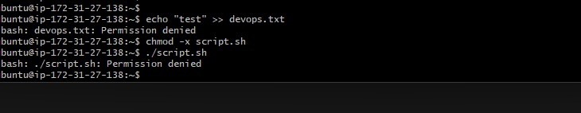
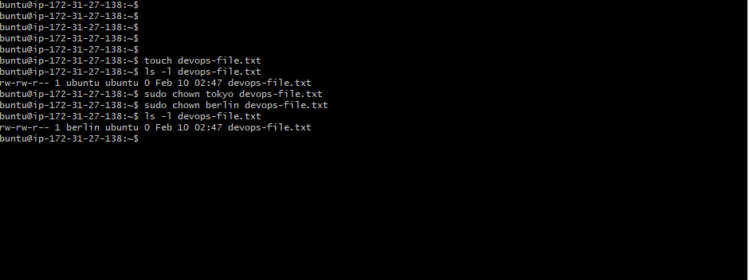
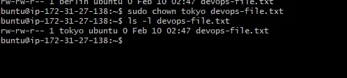
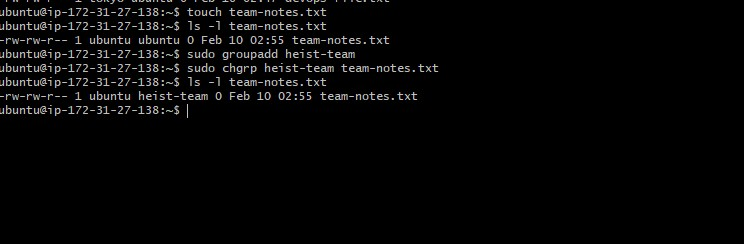
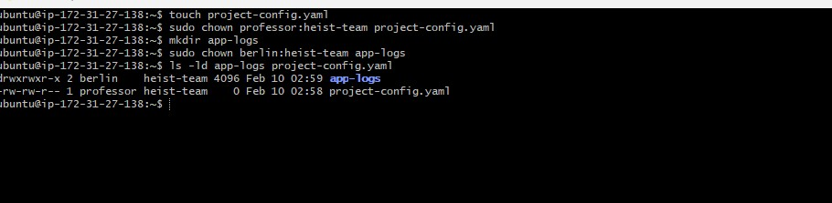
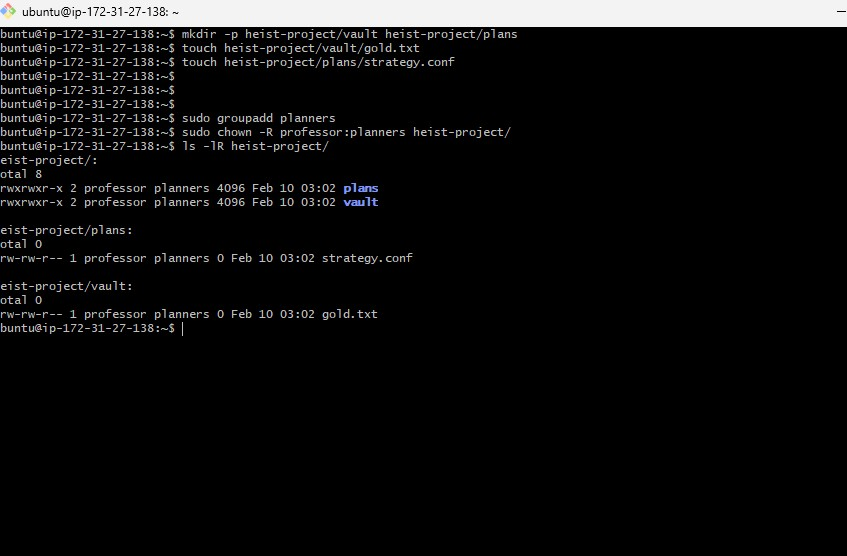
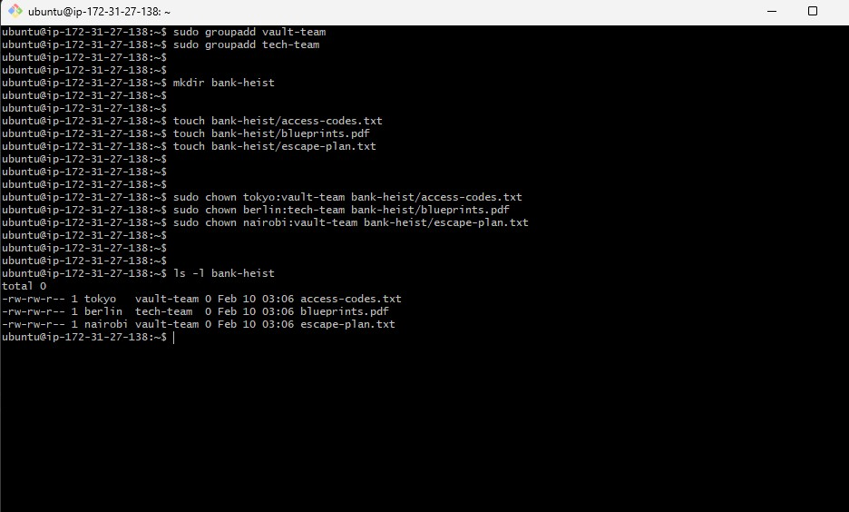

### Task 1: Understanding Ownership (10 minutes)

1. Run `ls -l` in your home directory

2. Identify the **owner** and **group** columns

3. Check who owns your files


**Format:** `-rw-r--r-- 1 owner group size date filename`

Document: What's the difference between owner and group?

Owner → the user who owns the file 
Group → a group of users who may share access
Permissions are checked in this order: owner → group → others


screenshot :



### Task 2: Basic chown Operations (20 minutes)

1. Create file `devops-file.txt`
ls -l devops-file.txt
2. Check current owner: `ls -l devops-file.txt`

ls -l devops-file.txt
3. Change owner to `tokyo` (create user if needed)
sudo chown tokyo devops-file.txt
4. Change owner to `berlin`
sudo chown berlin devops-file.txt
5. Verify the changes

ls -l devops-file.txt


screenshot :


**Try:**

sudo chown tokyo devops-file.txt


screenshot :



### Task 3: Basic chgrp Operations (15 minutes)

1. Create file `team-notes.txt`
touch team-notes.txt


2. Check current group: `ls -l team-notes.txt`

3. Create group: `sudo groupadd heist-team`

4. Change file group to `heist-team`
sudo chgrp heist-team team-notes.txt
5. Verify the change


screenshot :



### Task 4: Combined Owner & Group Change (15 minutes)

Using `chown` you can change both owner and group together:

1. Create file `project-config.yaml`
touch project-config.yaml
2. Change owner to `professor` AND group to `heist-team` (one command)
sudo chown professor:heist-team project-config.yaml


3. Create directory `app-logs/`
mkdir app-logs


4. Change its owner to `berlin` and group to `heist-team`

sudo chown berlin:heist-team app-logs

screenshot :



### Task 5: Recursive Ownership (20 minutes)

1. Create directory structure:
   ```
   mkdir -p heist-project/vault
   mkdir -p heist-project/plans
   touch heist-project/vault/gold.txt
   touch heist-project/plans/strategy.conf
   ```

2. Create group `planners`: `sudo groupadd planners`

3. Change ownership of entire `heist-project/` directory:
   - Owner: `professor`
   - Group: `planners`
   - Use recursive flag (`-R`)

4. Verify all files and subdirectories changed: `ls -lR heist-project/`

screenshot :



### Task 6: Practice Challenge (20 minutes)

1. Create users: `tokyo`, `berlin`, `nairobi` (if not already created)
2. Create groups: `vault-team`, `tech-team`


sudo groupadd vault-team
sudo groupadd tech-team

3. Create directory: `bank-heist/`
mkdir 
4. Create 3 files inside:
   ```
   touch bank-heist/access-codes.txt
   touch bank-heist/blueprints.pdf
   touch bank-heist/escape-plan.txt
   ```

5. Set different ownership:
   - `access-codes.txt` → owner: `tokyo`, group: `vault-team`
   - `blueprints.pdf` → owner: `berlin`, group: `tech-team`
   - `escape-plan.txt` → owner: `nairobi`, group: `vault-team`

**Verify:** `ls -l bank-heist/`


screenshot :



## Files & Directories Created
- devops-file.txt
- team-notes.txt
- project-config.yaml
- app-logs
- heist-project
  - vault
    - gold.txt
  - plans/
    - strategy.conf
- bank-heist
  - access-codes.txt
  - blueprints.pdf
  - escape-plan.txt

## Ownership Changes
- devops-file.txt  
  ubuntu:ubuntu → tokyo:ubuntu → berlin:ubuntu

- team-notes.txt  
  ubuntu:ubuntu → ubuntu:heist-team

- project-config.yaml  
  ubuntu:ubuntu → professor:heist-team

- app-logs/  
  ubuntu:ubuntu → berlin:heist-team

- heist-project/ (recursive)  
  ubuntu:ubuntu → professor:planners

- bank-heist
  access-codes.txt  
  ubuntu:ubuntu → tokyo:vault-team

- blueprints.pdf  
  ubuntu:ubuntu → berlin:tech-team

- escape-plan.txt  
  ubuntu:ubuntu → nairobi:vault-team


## Commands Used
touch 
mkdir
ls -l
sudo useradd -m
sudo groupadd
sudo chown 
sudo chgrp 
sudo chown user:group file
sudo chown -R user:group directory

## What I Learned

File ownership controls who owns ,manages files and shared access.
chown can change both owner and group, and the -R flag applies changes recursively


