### Task 1: For Loop
1. Create `for_loop.sh` that:
   - Loops through a list of 5 fruits and prints each one

screenshot :
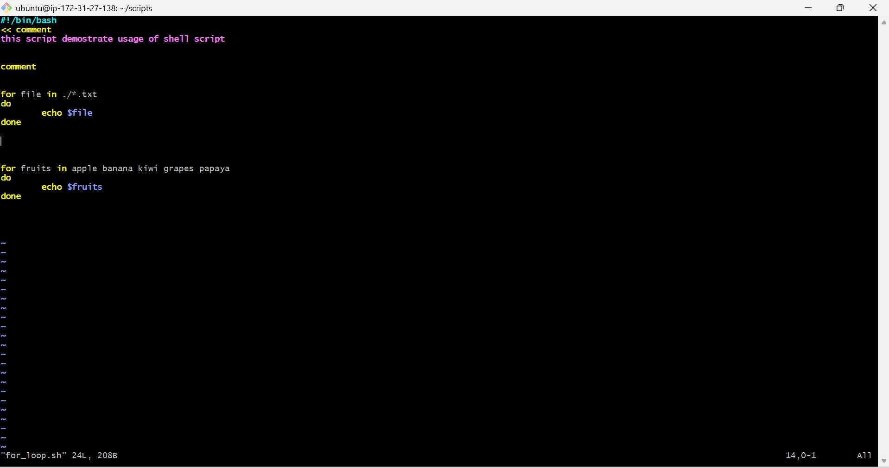

screenshot :
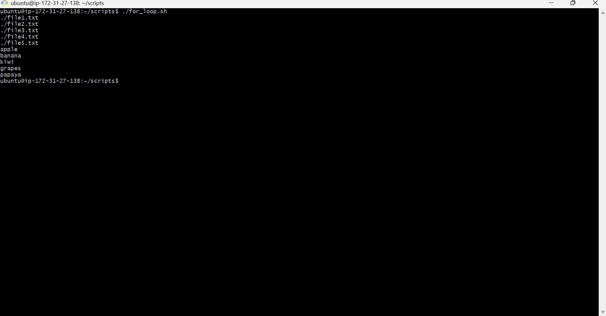

2. Create `count.sh` that:
   - Prints numbers 1 to 10 using a for loop

screenshot :
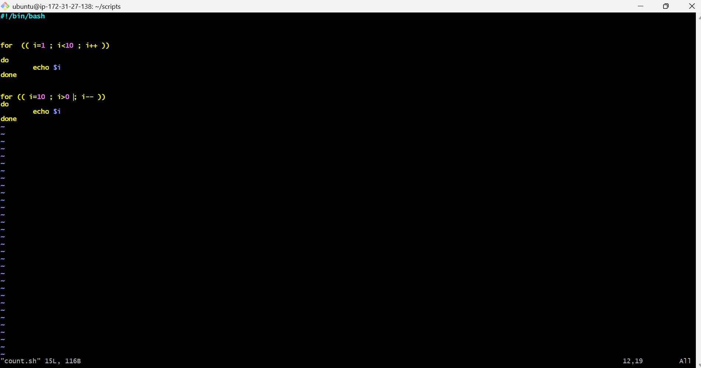

screenshot :
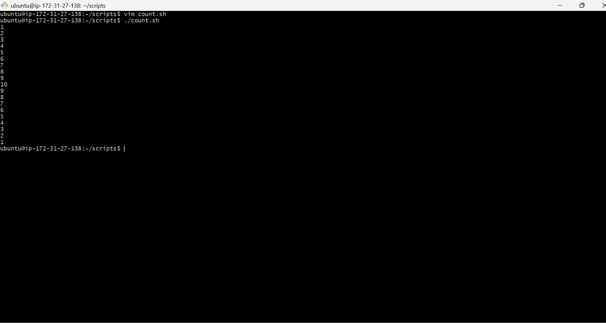

### Task 2: While Loop
1. Create `countdown.sh` that:
   - Takes a number from the user
   - Counts down to 0 using a while loop
   - Prints "Done!" at the end

screenshot :
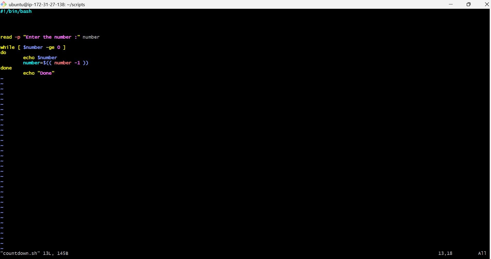

screenshot :
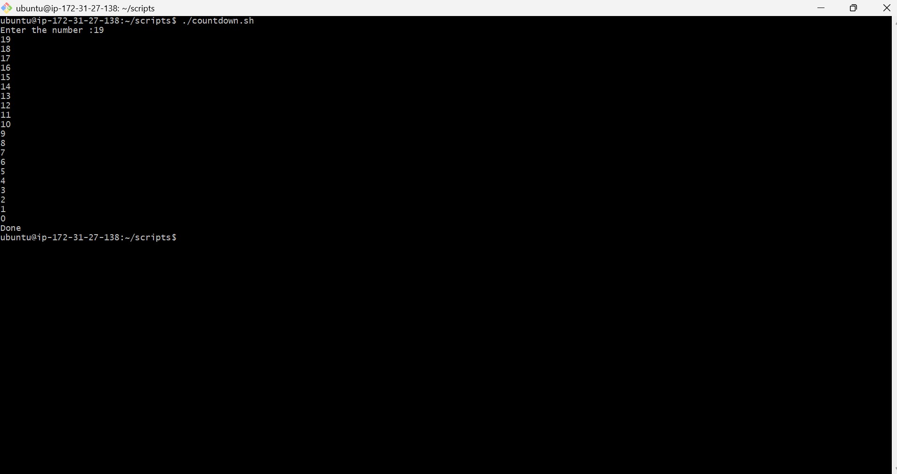

### Task 3: Command-Line Arguments
1. Create `greet.sh` that:
   - Accepts a name as `$1`
   - Prints `Hello, <name>!`
   - If no argument is passed, prints "Usage: ./greet.sh <name>"

screenshot :
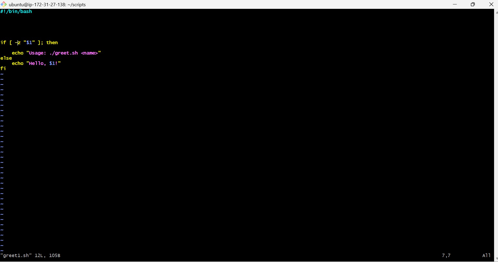

screenshot :
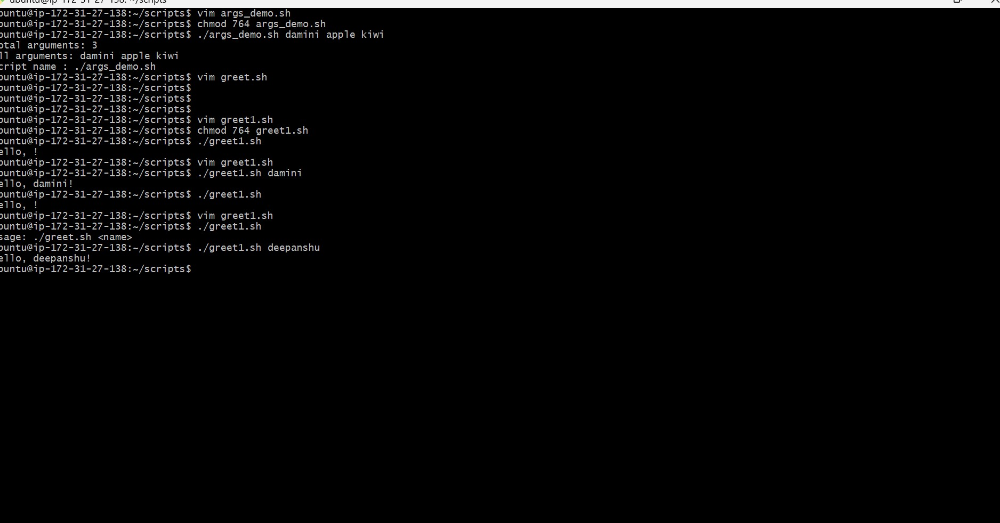

2. Create `args_demo.sh` that:
   - Prints total number of arguments (`$#`)
   - Prints all arguments (`$@`)
   - Prints the script name (`$0`)

screenshot :
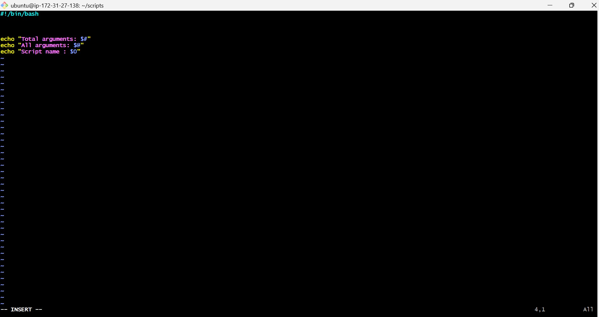

screenshot :
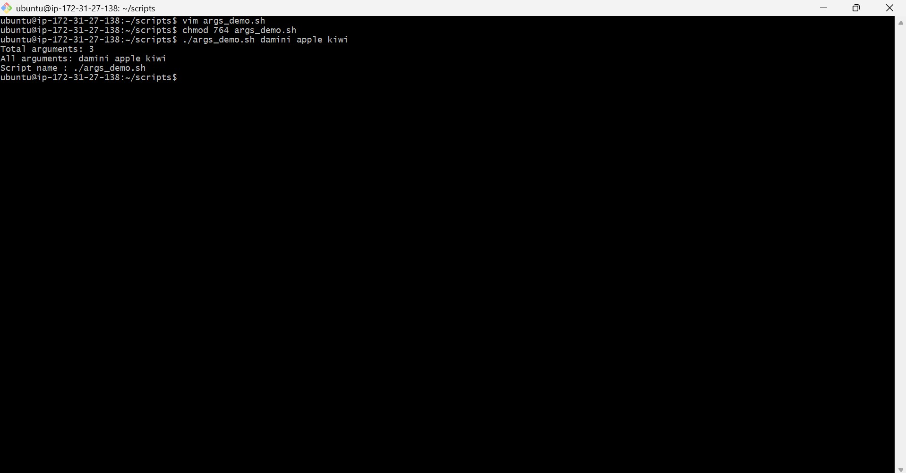

### Task 4: Install Packages via Script
1. Create `install_packages.sh` that:
   - Defines a list of packages: `nginx`, `curl`, `wget`
   - Loops through the list
   - Checks if each package is installed (use `dpkg -s` or `rpm -q`)
   - Installs it if missing, skips if already present
   - Prints status for each package

> Run as root: `sudo -i` or `sudo su`

screenshot :
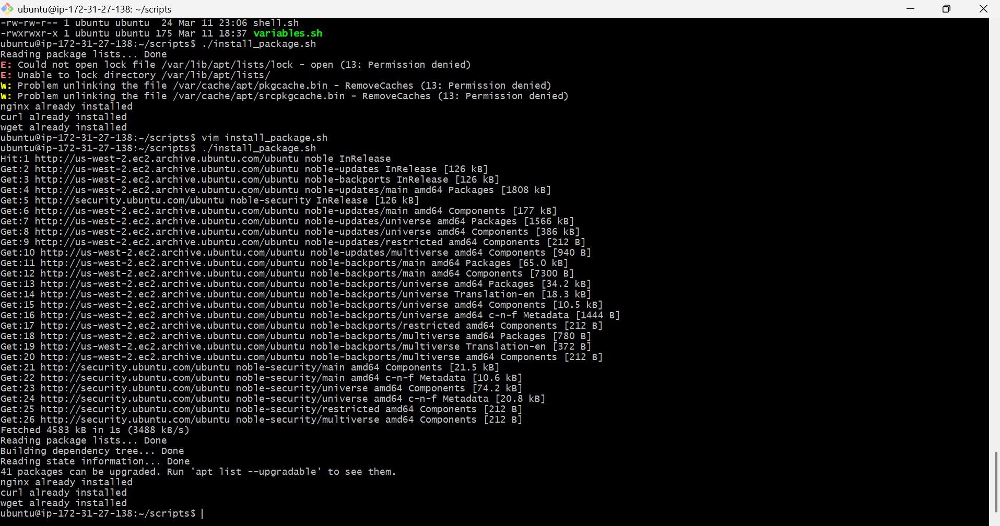

screenshot :
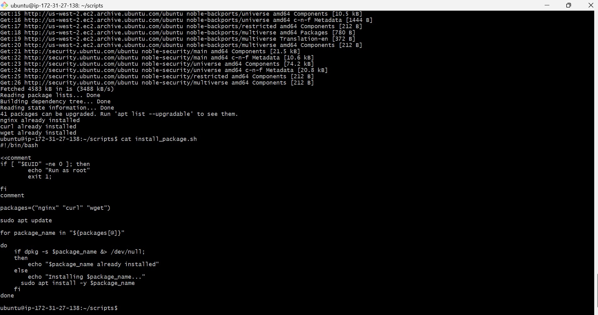

### Task 5: Error Handling
1. Create `safe_script.sh` that:
   - Uses `set -e` at the top (exit on error)
   - Tries to create a directory `/tmp/devops-test`
   - Tries to navigate into it
   - Creates a file inside
   - Uses `||` operator to print an error if any step fails

screenshot :
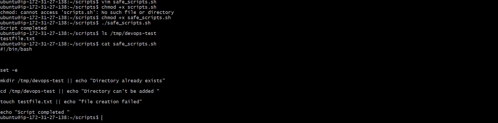

