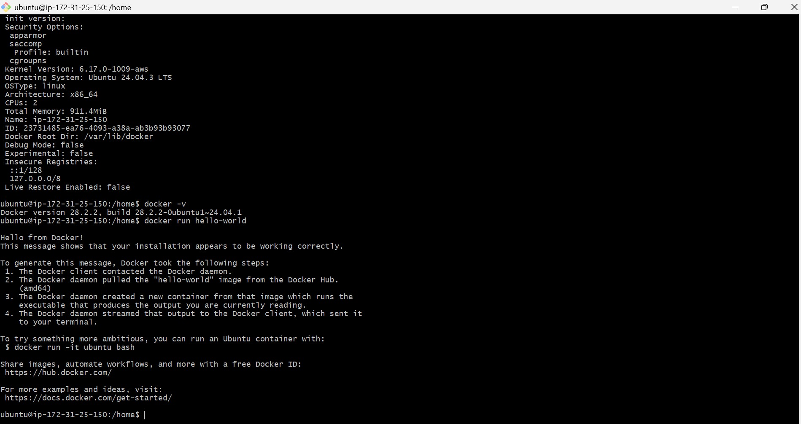
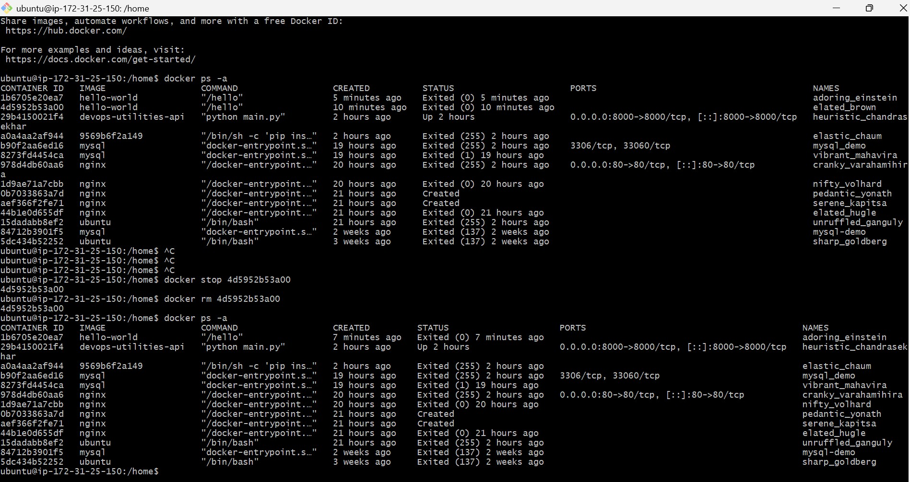
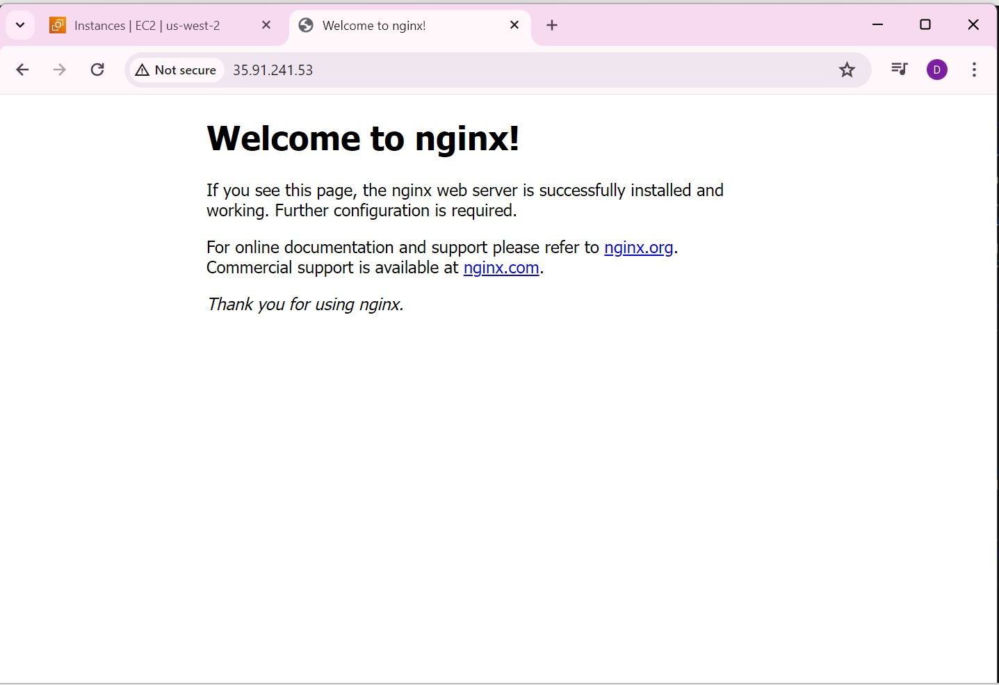
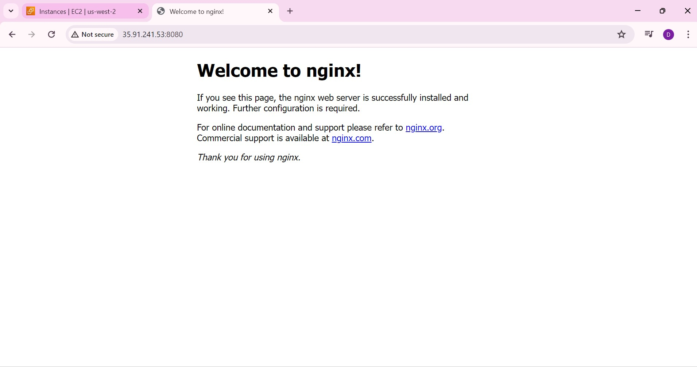
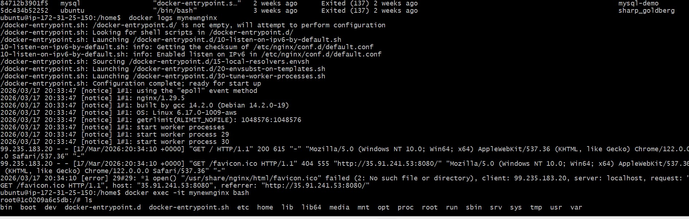

### Task 1: What is Docker?
Research and write short notes on:
- What is a container and why do we need them?
 Container is a lightweight package with application code , dependencies and system Tools.
and , we need to provide consistent env , fast deployment and scaling and make apps portable with less resouces as compared to VM's.

- Containers vs Virtual Machines — what's the real difference?
 containers = share host os , lightweight and fast with low resource usage whereas,
 virtual Machines is heavy and fully isolated and have it's own os 

- What is the Docker architecture? (daemon, client, images, containers, registry)
 Docker has:

Docker Client → where commands run
Docker Daemon → manages containers
Images → templates
Containers → running instances
Registry → Docker Hub

Draw or describe the Docker architecture in your own words.

        +---------------------+
        |   Docker Client     |
        | (docker commands)   |
        +----------+----------+
                   |
                   v
        +---------------------+
        |   Docker Daemon     |
        |    (dockerd)        |
        +----+--------+-------+
             |        |
             v        v
      +---------+  +---------+
      | Images  |  |Containers|
      +---------+  +---------+
             |
             v
     +------------------+
     | Docker Registry  |
     | (Docker Hub)     |
     +------------------+

### Task 2: Install Docker
1. Install Docker on your machine (or use a cloud instance)
2. Verify the installation
3. Run the `hello-world` container
4. Read the output carefully — it explains what just happened

screenshot :
    

 ### Task 3: Run Real Containers
1. Run an **Nginx** container and access it in your browser
2. Run an **Ubuntu** container in interactive mode — explore it like a mini Linux machine
3. List all running containers
4. List all containers (including stopped ones)
5. Stop and remove a container

screenshot :
    

screenshot :
    

### Task 4: Explore
1. Run a container in **detached mode** — what's different?
command : docker run -d nginx
2. Give a container a custom **name**
3. Map a **port** from the container to your host
command : docker run -d --name mynewnginx -p 8080:80 nginx

4. Check **logs** of a running container
docker logs mynewnginx

5. Run a command **inside** a running container
ls 

screenshot :
    

 screenshot :
    