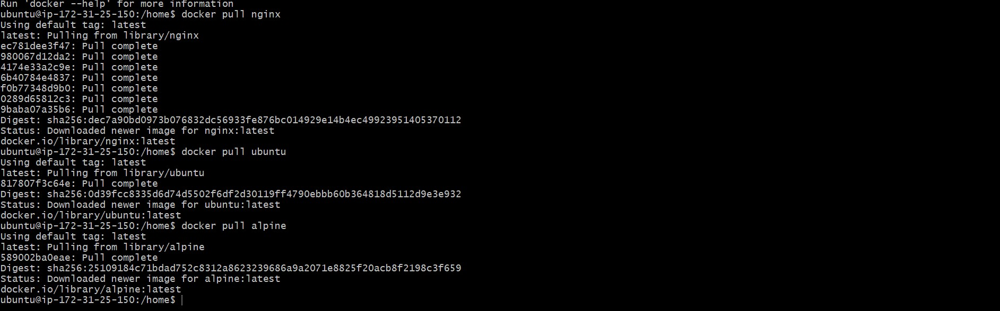
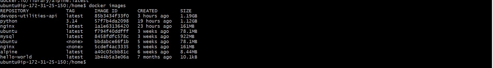
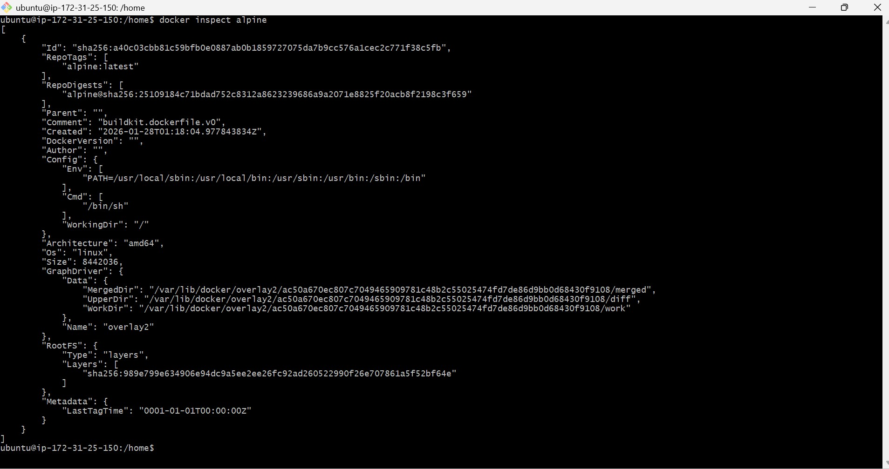
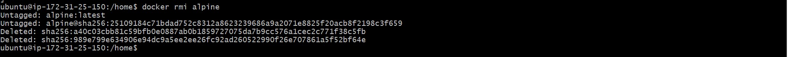
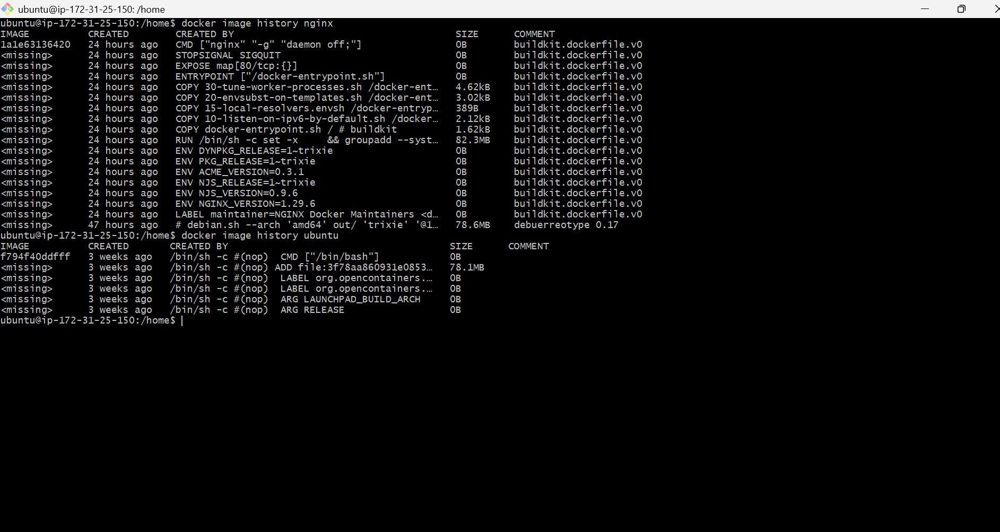
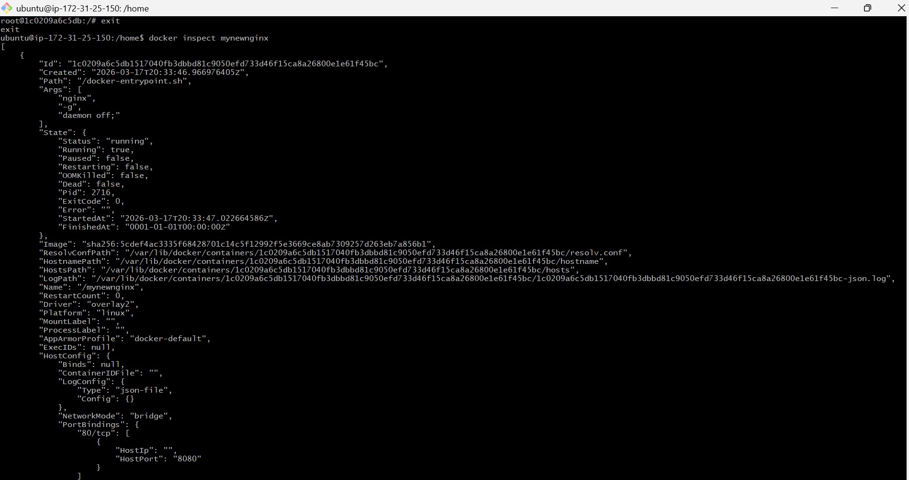
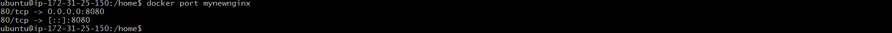
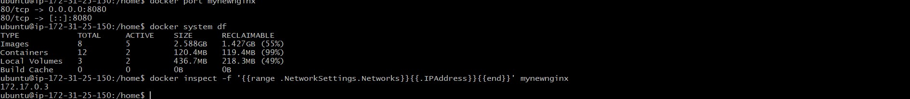
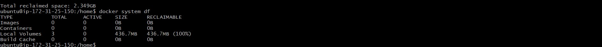

## Challenge Tasks

### Task 1: Docker Images
1. Pull the `nginx`, `ubuntu`, and `alpine` images from Docker Hub
    docker pull nginx
    docker pull ubuntu 
    docker pull alpine 

screenshot :
    

2. List all images on your machine — note the sizes
    docker images

screenshot :
    

ubuntu                 <none>    bbdabce66f1b   5 weeks ago    78.1MB
nginx                  <none>    5cdef4ac3335   5 weeks ago    161MB
alpine                 latest    a40c03cbb81c   6 weeks ago    8.44MB

3. Compare `ubuntu` vs `alpine` — why is one much smaller?

alpine is much smaller as compared to ubuntu and nginx
Reason for smaller size is few packages ,smaller layers and minimal design.

4. Inspect an image — what information can you see?
    docker inspect alpine
screenshot :
    

5. Remove an image you no longer need

screenshot :
    

### Task 2: Image Layers
1. Run `docker image history nginx` — what do you see?
    docker image history nginx
    docker image history ubuntu

screenshot :
    

2. Each line is a **layer**. Note how some layers show sizes and some show 0B
    Layers show size when they modify the filesystem (add/change files), and show 0B when they only define metadata or configuration without adding data.

3. Write in your notes: What are layers and why does Docker use them?
    What are layers?

Layers are read-only filesystem snapshots created by each instruction in a Dockerfile.
Each layer represents a change: adding files, installing packages, or configuring the image.
Layers are stacked on top of each other to form the final Docker image.

Why does Docker use layers?

Caching & faster builds 
Storage efficiency 
Easy updates & versioning 
Modularity & reusability 

### Task 3: Container Lifecycle
Practice the full lifecycle on one container:
1. **Create** a container (without starting it)
2. **Start** the container
3. **Pause** it and check status
4. **Unpause** it
5. **Stop** it
6. **Restart** it
7. **Kill** it
8. **Remove** it

Check `docker ps -a` after each step — observe the state changes.

docker create --name mycontainer ubuntu

docker start mycontainer 

docker pause mycontainer
docker unpause mycontainer
docker stop mycontainer
docker restat mycontainer 
docker kill mycontainer
docker rm mycontainer 

### Task 4: Working with Running Containers
1. Run an Nginx container in detached mode
2. View its **logs**
3. View **real-time logs** (follow mode)
4. **Exec** into the container and look around the filesystem
5. Run a single command inside the container without entering it
6. **Inspect** the container — find its IP address, port mappings, and mounts

I alreday completed all the steps in day29 task 4 so i will use the same Container 

screenshot :
    

screenshot :
    

for IP address :
docker inspect -f '{{range .NetworkSettings.Networks}}{{.IPAddress}}{{end}}' <container_name_or_id>
screenshot :
    

### Task 5: Cleanup
1. Stop all running containers in one command
2. Remove all stopped containers in one command
3. Remove unused images
4. Check how much disk space Docker is using

commands:
docker stop $(docker ps -q)
docker container prune
docker image prune
docker system df

screenshot :
    